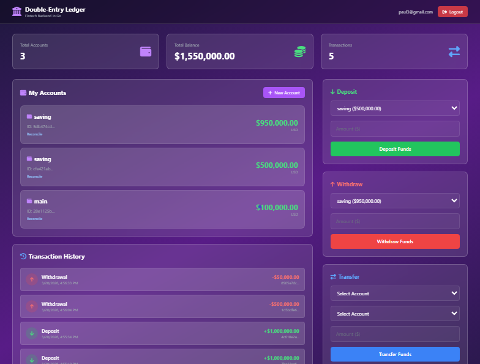

# Double-Entry Bank - Next.js Frontend

## Live Demo
https://golangbank.app

**Backend API: swagger** [double-entry-bank-Go](https://github.com/PaulBabatuyi/double-entry-bank-Go/swagger/index.html) 

## Quick Start

### 1. Install Dependencies

```bash
yarn install
```

### 2. Configure Environment

Copy the example env file and update with your API URL:

```bash
cp .env.local.example .env.local
```

For local development (backend on localhost:8080):
```
VITE_API_BASE_URL=http://localhost:8080
```

```

### 3. Run Development Server

```bash
yarn dev
```

Open [http://localhost:3000](http://localhost:3000) to view the app.

## Dashboard Preview

The dashboard provides a comprehensive interface for managing multiple bank accounts with real-time transaction tracking:



**Key Features:**
- View total accounts, balance, and transaction count at a glance
- Manage multiple accounts with detailed balance information
- Perform deposits, withdrawals, and transfers instantly
- Track transaction history with all account activities
- Intuitive UI with real-time updates

## API Documentation

The backend API is fully documented with Swagger/OpenAPI. All endpoints are RESTful and support double-entry accounting:


**Main Endpoint Categories:**
- `/accounts` - Manage bank accounts
- `/auth` - User authentication (login/register)
- `/transfers` - Transfer funds between accounts

## Scripts

- `yarn dev` - Start development server (watches for changes)
- `yarn build` - Build for production
- `yarn start` - Start production server
- `yarn lint` - Run ESLint to check code quality
- `yarn type-check` - Run TypeScript type checking

## Project Structure

```
app/
  ├── auth/
  │   └── page.tsx          # Login/Register page
  ├── dashboard/
  │   └── page.tsx          # Main dashboard
  ├── globals.css           # Global styles + animations
  ├── layout.tsx            # Root layout + providers
  └── page.tsx              # Redirect to auth/dashboard

components/
  ├── Toast.tsx             # Toast notification component
  ├── Providers.tsx         # Client-side providers
  └── dashboard/
      ├── Header.tsx        # Navigation header
      ├── DashboardStats.tsx
      ├── AccountsList.tsx
      ├── TransactionHistory.tsx
      ├── CreateAccountModal.tsx
      ├── DepositForm.tsx
      ├── WithdrawForm.tsx
      └── TransferForm.tsx

lib/
  ├── api.ts                # API client (fetch wrapper)
  ├── config.ts             # Configuration & constants
  ├── utils.ts              # Utility functions
  ├── types/
  │   └── index.ts          # TypeScript interfaces
  └── store/
      ├── authStore.ts      # Auth state (Zustand)
      └── toastStore.ts     # Toast state (Zustand)

middleware.ts              # Auth redirect middleware
```

## Key Changes from Original

### State Management
- **Before**: Global JavaScript objects (`state`, `auth`, `ui`)
- **After**: Zustand stores + React Context (Providers.tsx)

### Routing & Navigation
- **Before**: Single-page app with manual show/hide
- **After**: Next.js App Router with proper route layout groups

### UI Components
- **Before**: Imperative DOM manipulation with `createElement`
- **After**: React components with JSX

### Type Safety
- **Before**: Vanilla JS with no type checking
- **After**: Full TypeScript with strict mode

### API Layer
- **Before**: Global `api` object with hardcoded endpoints
- **After**: Modular `lib/api.ts` functions, all typed

### Environment Configuration
- **Before**: Hard-coded URL resolution in config.js
- **After**: Environment variable `VITE_API_BASE_URL`

## Authentication Flow

1. User lands on `/` → Providers hydrate auth state from localStorage
2. If token exists → redirect to `/dashboard`
3. If not → redirect to `/auth`
4. User logs in/registers → token saved to localStorage + Zustand store
5. Middleware intercepts routes and ensures auth state

## API Integration

All API calls go through `lib/api.ts`:

```typescript
import { login, register, deposit, withdraw, transfer } from "@/lib/api";

const { response, data } = await login(email, password);
```

The API client automatically:
- Adds Bearer token to headers
- Handles 401 errors (logs out user)
- Parses JSON responses

**For comprehensive API documentation**, visit the Swagger UI at your backend instance (e.g., `http://localhost:8080/swagger/index.html`)

## Deployment to Vercel

1. Push code to GitHub
2. Connect repo to Vercel
3. Set environment variable: `VITE_API_BASE_URL=....`
4. Deploy

## Troubleshooting

### Build fails with TypeScript errors
```bash
yarn type-check
```

### API calls fail (CORS or 404)
- Check `VITE_API_BASE_URL` matches backend URL
- Ensure backend is running and accessible

### Tokens not persisting across refreshes
- Browser localStorage must be enabled
- Check that Providers component is rendered

## Further Enhancements

- [ ] React Query/SWR for automatic cache invalidation
- [ ] Server-side auth with cookies (httpOnly)
- [ ] Advanced transaction filtering
- [ ] Dark/light theme toggle
- [ ] Performance optimization with React Suspense
